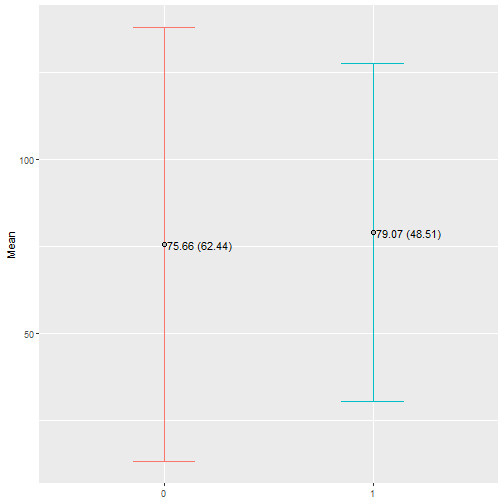
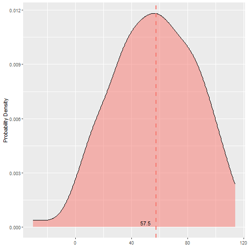

``` r
#source("~/Codigos úteis/R program/df_ficticio.R", echo=TRUE)
#dff
```


``` r
library(ggplot2) # graficos
library(ggthemes) # temas ggplot
library(scales) # escalas dos eixos
library(patchwork) # graficos lado a lado => (graf1 + graf2)/graf3
library(gridExtra) # graficos lado a lado 2 => grid.arrange(p1, p2, ncol=2)

# library(ggpubr) #ggplot (+estatistica) facilitado
# library(ggsignif) #significancia entre grupos
```


# Representar Proporções


``` r
cont_grafi = function(df, coluna){
  # Criando tabela de contagem
  tabela = df %>% filter(!is.na(!!sym(coluna))) %>% 
    group_by(!!sym(coluna)) %>% 
    summarise(qtd =n()) %>% 
    mutate(frequencia = round(qtd/sum(qtd)*100, 2)) %>% 
    ungroup()
  
  ggplot(tabela, aes(x=as.factor(!!sym(coluna)), y=frequencia, label=frequencia, fill=as.factor(!!sym(coluna)))) + 
    geom_col(show.legend=FALSE, color="black") + 
    geom_text(aes(y=frequencia, label = sprintf("%0.1f%%", frequencia), vjust=-0.5)) +
    # geom_label(aes(y=frequencia, label = sprintf("%0.1f%%", frequencia)), vjust=-0.5, fill='white') +
    theme(legend.position = "bottom") +
    scale_y_continuous(limits = c(0, 100), breaks=seq(from = 0, to = 100, by = 20)) +
    labs(x=NULL, y="frequenciauency (%)", title =NULL)
}

cont_grafi(dff, 'desfecho')
```


``` r
cont_grafi(dff, 'tratamentos')
```


``` r
#ggsave("nome_grafico.png", height=15, width=20, units="cm", dpi= 600)
```


``` r
#para representar uma tabela de contingencia (categorica vs categorica)

conti_grafi = function(df, coluna_x, coluna_y, sentido_percent='col'){
  
  if (sentido_percent == 'row'){ #algoritmo de troca troca #la_ele #kapa_pride
    temp = coluna_x
    coluna_x = coluna_y
    coluna_y = temp
  }
  
  # Criando tabela de contagem
  grafi = df %>% filter(!is.na(!!sym(coluna_x)) & !is.na(!!sym(coluna_y))) %>% 
    group_by(!!sym(coluna_y), !!sym(coluna_x)) %>% 
    summarise(qtd = n()) %>% 
    mutate(frequencia = round(qtd/sum(qtd)*100, 2)) %>% 
    ungroup()
  
  ggplot(grafi, aes(x=as.factor(!!sym(coluna_y)), y=frequencia, fill=as.factor(!!sym(coluna_x)))) + 
    geom_bar(stat="identity", position=position_dodge2(preserve = 'single'), color='black') +
    geom_text(aes(y=frequencia, label = sprintf("%0.1f%%", frequencia)), 
              position=position_dodge2(width = 0.9, preserve = 'single'), vjust=-0.5, hjust=0.5) +
    # geom_label(aes(y=frequencia, label = sprintf("%0.1f%%", frequencia)), 
    #            position=position_dodge2(width = 0.9, preserve = 'single'), vjust=-0.5, hjust=0.5, fill='white') +
    theme(legend.position = "bottom") +
    scale_y_continuous(labels = scales::percent) +
    scale_y_continuous(limits = c(0, 100), breaks=seq(from=0, to=100, by=10)) +
    labs(x=NULL, y='Frequency (%)', title=NULL, fill=NULL)
}

conti_grafi(dff, 'desfecho', 'tratamentos')
```

```
## `summarise()` has grouped output by 'tratamentos'. You can override using the `.groups` argument.
## Scale for y is already present. Adding another scale for y, which will replace the existing scale.
```

-1.png)

``` r
#ggsave("nome_grafico.png", height=15, width=20, units="cm", dpi= 600)
```

# Representar numeros


``` r
# para representar analise númerica por grupo (variavel: numerica vs categorica)

box_vin_jit = function(df, col_num, col_cat, arredondamento = 0){
  
  # Calcular medianas e quartis
  quartis = df %>%
    group_by(!!sym(col_cat)) %>%
    summarise(
      mediana = median(!!sym(col_num), na.rm = TRUE) %>% round(arredondamento),
      Q1 = quantile(!!sym(col_num), probs = 0.25, na.rm = TRUE) %>% round(arredondamento),
      Q3 = quantile(!!sym(col_num), probs = 0.75, na.rm = TRUE) %>% round(arredondamento)
    )

  ggplot(df, aes(x=as.factor(!!sym(col_cat)), y=!!sym(col_num), fill=as.factor(!!sym(col_cat)))) + 
    # Graficos
    #geom_jitter(alpha=0.5, show.legend=F, size=2.5, position=position_jitter(0.25)) +
    geom_violin(alpha=0.2, show.legend=F, fill='white') +
    geom_boxplot(alpha=0.8, show.legend=F, width=0.5) + #outlier.shape = NA
    # Medias extras
    geom_errorbar(stat = "summary", fun.data = "mean_se", width= 0.3, color="white") +
    geom_point(stat = "summary", fun = "mean", show.legend=F,
               shape=21, fill='red', color="black", size=3) +
    # Adicionar labels de texto
    geom_text(data = quartis, aes(x =!!sym(col_cat), y = mediana,
                                  label = paste0(mediana, " [",Q1, ' - ', Q3,']')), 
            vjust = -1.5, hjust = 0.5) +
    # Outros
    theme(legend.position = "bottom") +
    labs(x=NULL, y=NULL, title=NULL)
}

box_vin_jit(dff, 'var_num', 'tratamentos')
```


``` r
box_vin_jit(dff, 'var_num', 'desfecho') #+ coord_flip()
```


``` r
#ggsave("nome_grafico.png", height=10, width=10.5, units="cm", dpi= 600)
```


``` r
# para representar amostras pareadas

box_pareado = function(df_selecionado, palavra_padrao_da_coluna_analisada){
  df_filter = na.omit(df_selecionado)

  # Transformando para o formato longo
  df_filter$ID = 1:nrow(df_filter)
  dados_long = pivot_longer(df_filter, cols = starts_with(palavra_padrao_da_coluna_analisada), 
                             names_to = "momentos", values_to = "medida_numerica")
  
  # Grafico
  ggplot() +
    geom_boxplot(data=dados_long, aes(x=as.factor(momentos), y=medida_numerica, color=as.factor(momentos)),
                 alpha=0.5, fill = 'white', show.legend = F) +
    geom_point(data=dados_long, aes(x=as.factor(momentos), y=medida_numerica, color=as.factor(momentos)),
               alpha=0.5, size=2.5, show.legend = F) + 
    geom_line(data=dados_long, aes(x=as.factor(momentos), y=medida_numerica, color=as.factor(momentos), group = ID),
              alpha=0.5, show.legend = F) +
    labs(x=NULL, y=NULL, title=NULL) + 
    theme(legend.position = "none")
}

box_pareado(dff[c('momento_1', 'momento_2', 'momento_3')], 'momento')
```


``` r
box_pareado(dff[c('momento_1', 'momento_2', 'momento_3', 'tratamentos')], 'momento') + facet_grid(~tratamentos)
```


``` r
# para representar média e desvio padrão (variavel: numerico (categorica vs categorica) )

dinamite = function(df, col_num, col_cat){
  # Tabela com medidas
  tabela = df %>% filter(!is.na(!!sym(col_cat))) %>% 
    group_by(!!sym(col_cat)) %>%
    summarise(
      media = mean(!!sym(col_num), na.rm = TRUE),
      desvio_padrao = sd(!!sym(col_num), na.rm = TRUE)) %>% 
    mutate(ymin= media - desvio_padrao,
           ymax= media + desvio_padrao,
           media = media %>% round(2),
           desvio_padrao = desvio_padrao %>% round(2))
  tabela$ymin = ifelse(tabela$ymin <= 0, 0.01, tabela$ymin)
  
  ggplot(tabela, aes(x=as.factor(!!sym(col_cat)), y=media, fill=as.factor(!!sym(col_cat)))) +
    # Grafico
    geom_bar(stat="summary", fun="mean", color='black', position=position_dodge(0.75)) +
    geom_errorbar(aes(ymin=ymin, ymax=ymax), width=0.3, position=position_dodge(0.75)) +
    geom_point(stat="summary", fun="mean", position=position_dodge(0.75),
               shape=21, fill='grey70', color="black", size=2) +
    # Outros
    geom_text(aes(label = paste0(media, " (",desvio_padrao,')')),
              position= position_dodge2(0.75), vjust=-0.5, hjust=-0.05) +
    theme(legend.position= "none") +
    labs(x=NULL, y= "Mean", title=NULL) #+ coord_flip()
}

dinamite(dff, 'momento_3', 'desfecho')
```


``` r
dinamite(dff, 'momento_3', 'tratamentos')
```


``` r
grafico_de_erro = function(df, col_num, col_cat){
  # Tabela com medidas
  tabela = df %>% filter(!is.na(!!sym(col_cat))) %>% 
    group_by(!!sym(col_cat)) %>%
    summarise(
      media = mean(!!sym(col_num), na.rm = TRUE),
      desvio_padrao = sd(!!sym(col_num), na.rm = TRUE)) %>% 
    mutate(ymin= media - desvio_padrao,
           ymax= media + desvio_padrao,
           media = media %>% round(2),
           desvio_padrao = desvio_padrao %>% round(2))
  tabela$ymin = ifelse(tabela$ymin <= 0, 0.01, tabela$ymin)
  
  ggplot(tabela, aes(x=as.factor(!!sym(col_cat)), y=media, color=as.factor(!!sym(col_cat)))) +
    geom_errorbar(aes(ymin=ymin, ymax=ymax), width=0.3, position=position_dodge(0.75)) +
    geom_point(stat="summary", fun="mean", position=position_dodge(0.75),
               shape=21, fill='grey70', color="black", size=2) +
    geom_text(aes(label = paste0(media, " (",desvio_padrao,')')), color='black',
              position= position_dodge2(0.75), hjust=-0.05) +
    theme(legend.position= "none") +
    labs(x=NULL, y= "Mean", title=NULL)
}

grafico_de_erro(dff, 'momento_3', 'desfecho')
```



``` r
grafico_de_erro(dff, 'momento_3', 'tratamentos')
```


``` r
densidade_grafi = function(df, col_num, col_cat){
  
  if (shapiro.test(df[[col_num]])$p.value == TRUE){
    medidas = df %>% summarize(medida = mean(!!sym(col_num)))
  } else {
    medidas = df %>% summarize(medida = median(!!sym(col_num)))
  }
  
  ggplot(df, aes(x=!!sym(col_num), fill='tomato')) +
    geom_density(position='identity', alpha =0.5)+
    geom_vline(data = medidas, aes(xintercept = medida, color = 'red'), 
               linetype="dashed", size=1, show.legend=F) +
    geom_text(data = medidas, aes(x = medida, label = round(medida, 1), y = 0), 
              color="black", vjust = -0.5, hjust = 1.5) +
    theme(legend.position = "none") +
    labs(x=NULL, y='Probability Density', fill=NULL)
}

densidade_grafi(dff, 'var_num')
```




``` r
# variavel: numerica vs categorica

densidade_grafi = function(df, col_num, col_cat){
  
  if (normalidade_por_grupo_criterio(df, col_num, col_cat) == TRUE){
    medidas = df %>% group_by(!!sym(col_cat)) %>% summarize(medida = mean(!!sym(col_num)))
  } else {
    medidas = df %>% group_by(!!sym(col_cat)) %>% summarize(medida = median(!!sym(col_num)))
  }
  
  ggplot(df, aes(x=!!sym(col_num), fill=as.factor(!!sym(col_cat)))) +
    geom_density(position='identity', alpha =0.5)+
    geom_vline(data = medidas, aes(xintercept = medida, color = as.factor(!!sym(col_cat))), 
               linetype="dashed", size=1, show.legend=F) +
    geom_text(data = medidas, aes(x = medida, label = round(medida, 0), y = 0), 
              color="black", vjust = -0.5, hjust = 1.5) +
    theme(legend.position = "bottom") +
    labs(x=NULL, y='Probability Density', fill=NULL)
}

densidade_grafi(dff, 'momento_3', 'desfecho')
```


``` r
densidade_grafi(dff, 'momento_3', 'desfecho') + facet_grid(~desfecho)
```


``` r
densidade_grafi(dff, 'momento_3', 'tratamentos') + facet_grid(~tratamentos)
```


``` r
teste_normalidade = function(df, coluna, qtd_bins=20, cor_esc=1, plot_qqplot = T){
  media = mean(df[[coluna]], na.rm=T)
  desvpad = sd(df[[coluna]], na.rm=T)
  
  if (nrow(df) > 3 & nrow(df) < 5000){
    p_valor = shapiro.test(df[[coluna]])$p.value %>% retorne_p() %>% retorne_p_ajust()
    subtitulo = paste(p_valor, '(Shapiro-wilk)')
  } else {
    p_valor = ks.test(df[[coluna]], "pnorm", mean=media, sd=desvpad)$p.value %>% retorne_p() %>% retorne_p_ajust()
    subtitulo = paste(p_valor, '(Kolmogorov-Smirnov)')
  }
  
  lista_cor0 = c('tomato','#40BCD8','#fdf0d5','#fefee3','#bee9e8','#f6aa1c','grey75') # COR DA BARRA
  lista_cor1 = c('red','black','black','black','black','black','black') # COR DA BARRA
  lista_cor2 = c('red','blue','#c1121f','#d68c45','#1b4965','#941b0c','grey45') # COR DA LINHA
  
  p1 = ggplot(df, aes(x=!!sym(coluna)))+
    geom_histogram(aes(y=..density..), bins=qtd_bins, 
                   fill = lista_cor0[cor_esc], alpha = 0.7, 
                   colour = lista_cor1[cor_esc]) +
    geom_density(lwd = 1.2, linetype = 2, colour = lista_cor2[cor_esc]) +
    geom_function(fun= dnorm, args=list(mean=media,sd=desvpad), col='black', lwd=1, lty=4) +
    labs(x=NULL, y='Probability Density', subtitle = subtitulo) +
    theme_minimal()
  
  if (plot_qqplot == T){
    p2 = ggplot(data = df, aes(sample = !!sym(coluna))) +
    stat_qq(shape=21, size=2.5, fill=lista_cor0[cor_esc], alpha = 0.5) + 
    stat_qq_line() +
    labs(subtitle = '', x = 'Theoretical Quantiles', y = NULL) + #'Standardized Residuals'
    theme_minimal()
    return((p1+p2))
  } else {
    return(p1)
  }
}

teste_normalidade(dff, 'var_num', cor_esc = 1)
```


``` r
teste_normalidade(dff, 'var_num', cor_esc = 2) #+ facet_grid(~desfecho) + labs(subtitle = NULL)
```


``` r
teste_normalidade(dff, 'var_num', cor_esc = 3) #+ facet_grid(tratamentos~.) + labs(subtitle = NULL)
```


``` r
teste_normalidade(dff, 'var_num', cor_esc = 4)
```


``` r
teste_normalidade(dff, 'var_num', cor_esc = 5)
```


``` r
teste_normalidade(dff, 'var_num', cor_esc = 6) 
```


``` r
#para lidar com objetos lmerMod.
library(broom)
library(broom.mixed)

# https://library.virginia.edu/data/articles/diagnostic-plots
library(lmtest)

# Função para calcular resíduos padronizados
calc_std_resid <- function(modelo, model_diag) {
  resid <- residuals(modelo)
  hat_values <- model_diag$.hat
  sigma <- sigma(modelo)
  std_resid <- resid / (sigma * sqrt(1 - hat_values))
  return(std_resid)
}

# Função principal
lm_diagnostic <- function(modelo) {
  # Obter resíduos e valores ajustados
  if (inherits(modelo, "lm") | inherits(modelo, "glm")) {
    model_diag <- augment(modelo)
    model_diag <- model_diag %>%
      mutate(.std.resid = rstandard(modelo))
  } else if (inherits(modelo, "lmerMod") | inherits(modelo, "glmerMod")) {
    model_diag <- augment(modelo)
    model_diag <- model_diag %>%
      mutate(.std.resid = calc_std_resid(modelo, model_diag))
  } else {
    stop("O modelo fornecido não é suportado. Use um modelo 'lm' ou 'lmerMod'.")
  }
  
  # Gráfico 1: Residuals vs Fitted - Homogeneidade dos Resíduos
  p1 <- ggplot(model_diag, aes(.fitted, .resid)) +
    geom_point(shape=21, size=2, alpha=0.5) +
    geom_hline(aes(yintercept = 0), linetype="dashed", size=1) +
    geom_smooth(se = FALSE, color = "red") +
    labs(title = "Residuals vs Fitted",
         x = "Fitted values",
         y = "Residuals")
  
  # Gráfico 2: Normal Q-Q - Normalidade dos Resíduos
  ## teste de hipotese: Normalidade (Shapiro Wilk):
  p_valor_Shapiro = shapiro.test(model_diag$.std.resid)$p.value %>% retorne_p() %>% retorne_p_ajust()
  
  p2 <- ggplot(model_diag, aes(sample = .std.resid)) +
    stat_qq(shape=21, size=2) + 
    stat_qq_line() +
    labs(title = "Normal Q-Q",
         x = "Theoretical Quantiles",
         y = "Standardized Residuals",
    subtitle = paste0('Shapiro-wilk (',p_valor_Shapiro,')'))
  
  # Gráfico 3: Scale-Location - Homocedasticidade dos Residuos
  ## teste de hipotese: Homocedasticidade (Breusch-Pagan):
  p_valor_Breusch = lmtest::bptest(modelo_lm)$p.value %>% retorne_p() %>% retorne_p_ajust()
  p3 <- ggplot(model_diag, aes(.fitted, sqrt(abs(.std.resid)))) +
    geom_point(shape=21, size=2, alpha=0.5) +
    geom_smooth(se = FALSE, color = "red") +
    labs(title = "Scale-Location",
         x = "Fitted values",
         y = "sqrt(|Standardized Residuals|)",
         subtitle = paste0('Breusch-Pagan (',p_valor_Breusch,')'))
  
  # Gráfico 4: Residuals vs Leverage - Outliers/Pontos de Alavancagem
  p4 <- ggplot(model_diag, aes(.hat, .std.resid)) +
    geom_point(shape=21, size=2, alpha=0.5) +
    geom_smooth(se = FALSE, color = "red") +
    labs(title = "Residuals vs Leverage",
         x = "Leverage",
         y = "Standardized Residuals")
  
  # Exibir os gráficos em um layout 2x2
  return(grid.arrange(p1, p2, p3, p4, ncol = 2))
}

# Função principal
glm_diagnostic <- function(modelo) {
  # Obter resíduos e valores ajustados
  if (inherits(modelo, "glm")) {
    model_diag <- augment(modelo)
    model_diag <- model_diag %>%
      mutate(.std.resid = rstandard(modelo))
  } else if (inherits(modelo, "glmerMod")) {
    model_diag <- augment(modelo)
    model_diag <- model_diag %>%
      mutate(.std.resid = calc_std_resid(modelo, model_diag))
  } else {
    stop("O modelo fornecido não é suportado. Use um modelo 'lm' ou 'lmerMod'.")
  }
  
  # Gráfico 4: Residuals vs Leverage - Outliers/Pontos de Alavancagem
  p4 <- ggplot(model_diag, aes(.hat, .std.resid)) +
    geom_point(shape=21, size=2, alpha=0.5) +
    geom_smooth(se = FALSE, color = "red") +
    labs(title = "Residuals vs Leverage",
         x = "Leverage",
         y = "Standardized Residuals")
  
  # Exibir os gráficos em um layout 2x2
  return(p4)
}

modelo = glm(desfecho ~ fixed_effects + group, data = dff, family = binomial())
glm_diagnostic(modelo)
```

```
## `geom_smooth()` using method = 'loess' and formula = 'y ~ x'
```


``` r
modelo_lm = lm(desfecho_num ~ var_num, data=dff)
lm_diagnostic(modelo_lm)
```

```
## `geom_smooth()` using method = 'loess' and formula = 'y ~ x'
## `geom_smooth()` using method = 'loess' and formula = 'y ~ x'
## `geom_smooth()` using method = 'loess' and formula = 'y ~ x'
```


``` r
modelo_lmer <- lmerTest::lmer(response ~ fixed_effects + (1|group), data = dff)
lm_diagnostic(modelo_lmer)
```

```
## `geom_smooth()` using method = 'loess' and formula = 'y ~ x'
## `geom_smooth()` using method = 'loess' and formula = 'y ~ x'
## `geom_smooth()` using method = 'loess' and formula = 'y ~ x'
```


``` r
#### ALTERNATIVAS:
## Plotar gráficos diagnósticos usando ggplot2 e ggfortify
# install.packages("ggfortify")
# library(ggfortify)
# autoplot(modelo_lm, which = 1:4, ncol = 2) +
#   theme_minimal()

## Analise Grafica
# par(mfrow=c(2,2))
# plot(modelo_lm)
```


``` r
# Função para extrair resíduos de diferentes tipos de modelos
extrair_residuos <- function(modelo, nome_modelo) {
  model_diag <- augment(modelo)
  model_diag <- model_diag %>% mutate(modelo_nome = nome_modelo)
  res = model_diag[c('.resid', 'modelo_nome')]
  return(res)
}

# Função para combinar resíduos de vários modelos
combinar_residuos <- function(lista_modelos) {
  residuos_df <- bind_rows(lapply(seq_along(lista_modelos), function(i) {
    extrair_residuos(lista_modelos[[i]], paste("Modelo", i))
  }))
  return(residuos_df)
}

# Função para plotar o boxplot dos resíduos
plotar_boxplot_residuos <- function(lista_modelos, arredondamento = 2) {
  residuos_df <- combinar_residuos(lista_modelos)
  df = residuos_df
  col_cat = 'modelo_nome'
  col_num = '.resid'
  # Calcular medianas e quartis
  quartis = df %>%
    group_by(!!sym(col_cat)) %>%
    summarise(
      mediana = median(!!sym(col_num), na.rm = TRUE) %>% round(arredondamento),
      Q1 = quantile(!!sym(col_num), probs = 0.25, na.rm = TRUE) %>% round(arredondamento),
      Q3 = quantile(!!sym(col_num), probs = 0.75, na.rm = TRUE) %>% round(arredondamento)
    ) %>% 
    mutate(IQR = (Q3-Q1) %>% round(arredondamento))

  ggplot(df, aes(x=as.factor(!!sym(col_cat)), y=!!sym(col_num), fill=as.factor(!!sym(col_cat)))) + 
    # Graficos
    #geom_jitter(alpha=0.5, show.legend=F, size=2.5, position=position_jitter(0.25)) +
    geom_violin(alpha=0.2, show.legend=F, fill='white') +
    geom_boxplot(alpha=0.8, show.legend=F, width=0.5) + #outlier.shape = NA
    # Medias extras
    geom_errorbar(stat = "summary", fun.data = "mean_se", width= 0.3, color="white") +
    geom_point(stat = "summary", fun = "mean", show.legend=F,
               shape=21, fill='red', color="black", size=3) +
    # Adicionar labels de texto
    geom_text(data = quartis, aes(x =!!sym(col_cat), y = mediana,
                                  label = paste0(mediana, " [",Q1, ' - ', Q3,'][',IQR,']')), 
            vjust = -1.5, hjust = 0.5) +
    # Outros
    theme(legend.position = "bottom") +
    labs(x=NULL, y=NULL, title=NULL) + coord_flip()
}

# Exemplo de uso
modelo_lm0 <- lm(response ~ fixed_effects, data = dff)
modelo_lm <- lm(response ~ fixed_effects + group, data = dff)
modelo <- lmer(response ~ fixed_effects + (1|group), data = dff)

plotar_boxplot_residuos(list(modelo_lm0, modelo_lm, modelo))
```


``` r
# (data ou numerica vs categorica)
time_line_grafi = function(df, col_num, col_cat){
  tabela = df %>% 
    group_by(!!sym(col_num), !!sym(col_cat)) %>% 
    summarise(qtd =n()) %>% mutate(frequencia = round(n/sum(n), 2)) %>% ungroup()
  #filter(variavel_categorica == 1) %>% ungroup()
  
  ggplot(tabela, aes(x=!!sym(col_num), n, label=n, y=n)) + 
    geom_line() + geom_point(size=2) + 
    geom_text(aes(label = n), nudge_y = 1.5) +
    theme_classic()
}

#time_line_grafi(de, 'idade', 'desfecho')
```


``` r
fore_plot = function(tabela, titulo = NULL){
  xminimo = min(tabela$`2.5 %`, na.rm = T)
  xmaximo = max(tabela$`97.5 %`, na.rm = T)
  
  if ( xmaximo >= 100){
    escala = 'log10'
  } else{
    escala = 'log2'
  }
  
  plot1 = ggplot(tabela, aes(y = variavel, x = OR)) +
    geom_point(shape = 18, size = 5, color = 'navyblue') +  
    geom_errorbarh(aes(xmin = `2.5 %`, xmax = `97.5 %`), height = 0.25) +
    geom_vline(xintercept = 1, color = "red", linetype = "dashed", cex = 1, alpha = 0.5) +
    xlab("Odds Ratio (95% CI)") + 
    ylab(" ") + 
    labs(title=titulo) +
    theme_classic() +
    theme(panel.border = element_blank(),
          panel.background = element_blank(),
          panel.grid.major = element_blank(), 
          panel.grid.minor = element_blank(), 
          axis.line = element_line(colour = "black"),
          axis.text.y = element_text(size = 12, colour = "black"),
          axis.text.x.bottom = element_text(size = 12, colour = "black"),
          axis.title.x = element_text(size = 12, colour = "black")) + 
    scale_x_continuous(trans='log10') #+ xlim(c(xminimo-2, xmaximo+2)) #+ geom_text(aes(label = pvalor))
  
  table_base = ggplot(tabela, aes(y=variavel)) +
    ylab(NULL) + xlab("  ") + 
    theme(plot.title = element_text(hjust = 0.5, size=12), 
          axis.text.x = element_text(color="white", hjust = -3, size = 25), ## This is used to help with alignment
          axis.line = element_blank(),
          axis.text.y = element_blank(), 
          axis.ticks = element_blank(),
          axis.title.y = element_blank(), 
          legend.position = "none",
          panel.background = element_blank(), 
          panel.border = element_blank(), 
          panel.grid.major = element_blank(),
          panel.grid.minor = element_blank(), 
          plot.background = element_blank())
  
  tab1 = table_base +
    geom_text(aes(x = 1, label = pvalor), size = 4) + 
    ggtitle("P-valor")
  
  tab2 = table_base + 
    labs(title = "space") +
    geom_text(aes(x = 1, label = OR_IC), size = 4) +
    ggtitle("OR(IC)")
  
  lay =  matrix(c(1,1,1,1,1,1,1,1,1,1,2,3,3), nrow = 1)
  #return(grid.arrange(plot1, tab1, tab2, layout_matrix = lay))
  return(plot1)
}
```


